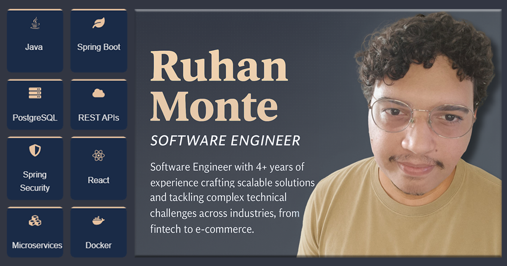

# Ruhan Monte - Code as Professional Identity 💻

## Origins of the Project 🌱

This professional webpage began as a **three-fold mission**:
1. **Professional Compass**: Create a dynamic showcase of my technical capabilities
2. **Learning Laboratory**: Experiment with modern web development patterns
3. **Teaching Platform**: Document architectural decisions for fellow developers

Born from late-night coding sessions and countless coffee cups, this project evolved from a simple resume page to a full-stacked professional identity system.

## Technical Philosophy in Practice 🛠️

**Stack Choices:**  
- React + TypeScript: Type-safe component architecture  
- Vite: Lightning-fast build system  
- CSS Modules: Scoped style management  
- React Icons: Unified icon ecosystem  

**Key Architectural Decisions:**  
- SEO-first SPA strategy  
- Mobile-first responsive patterns  
- CI/CD-powered performance budgets  
- Content-decoupled component design  

## Living Documentation Purpose 📘  

**Dual-Audience Approach:**  
- For Clients: Professional competency proof  
- For Developers: Open-source learning resource  

**Upcoming Educational Series:**  
- Video breakdowns of key components  
- Performance optimization case studies  
- TypeScript pattern deep-dives  